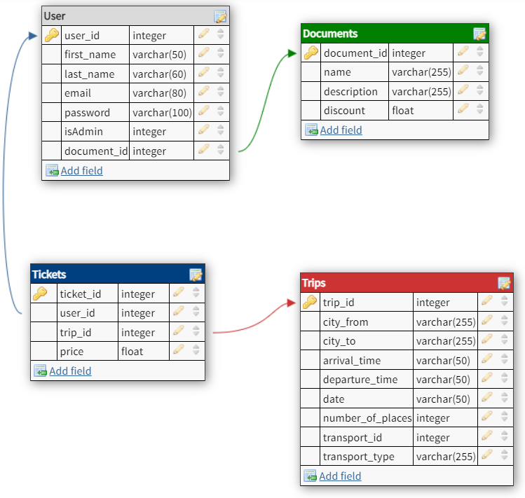

# UkrAbobus
## Опис проєкту
Кінцевою метою проєкту функціонуючий WEB-додаток, який дозволяє користувачам придбати квитки на зручний їм транспорт для
здійснення подорожі по Україні. На вибір користувача є три види транспорту: потяг, літак та автобус. На одному сайті 
користувач можете подивитись розклад для всіх цих типів транспортів та обрати найзручніший.
## Функціонал
Застосунок має наступний функціонал:
* Перегляд розкладу
* Придбання квитків із вибором типу документів, класу транспорту і тд.
* Форма авторизації
* Адмінська сторінка
* Перегляд запланованих поїздок
* Повернення квитків
## Опис бази даних
База даних створюється для інформаційного обслуговування користувачів сайту подорожей по Україні. БД повинна містити дані про транспорт, їх розклади, та типи транспортів і надавати можливість до швидкого і зручного обрання квитків. 

Відповідно до предметної області система будується з врахуванням наступних особливостей:
* Кожен транспорт має свої три різновиди.
* Кожен існуючий розклад має містити інформацію про дату прибуття, час прибуття, номер транспорту та кількість пасажирів.
* Користувач може скористуватись знижкою, якщо має певний статус (наприклад, студентська знижка).

Згідно з вимогами до БД, було побудовано наступну даталогічну модель:

